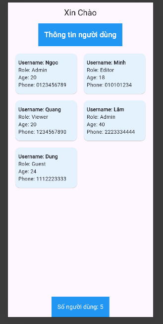

# Nguyễn Quốc Ngọc-22010189
# Các file trong bài tập 

## 1. `user.dart`
Chức năng:
- Định nghĩa lớp `User` biểu diễn thông tin mỗt người dùng.
- Bao gồm các thuộc tính: `username`, `password`, `role`, `age`, `phone`.
- Cung cấp các phương thức:
  - `displayInfo`: hiển thị thông tin người dùng (ngoại trừ mật khẩu).
  - `validatePassword`: kiểm tra tính đúng đắn của mật khẩu.

## 2. `object_creator.dart`
Chức năng:
- Tạo danh sách người dùng mẫu dưới dạng danh sách `List<User>`.
- Cung cấp thông tin người dùng như mẫu sẵn.

## 3. `main.dart`
Chức năng:
- Hiển thị giao diện người dùng.
- Sử dụng danh sách người dùng được tạo bởi `object_creator.dart`.
- Hiển thị thông tin người dùng trong GridView
- Layout bao gồm 3 phần trên (header), thân (body), và dưới (footer).

## Giao diện chính của ứng dụng

